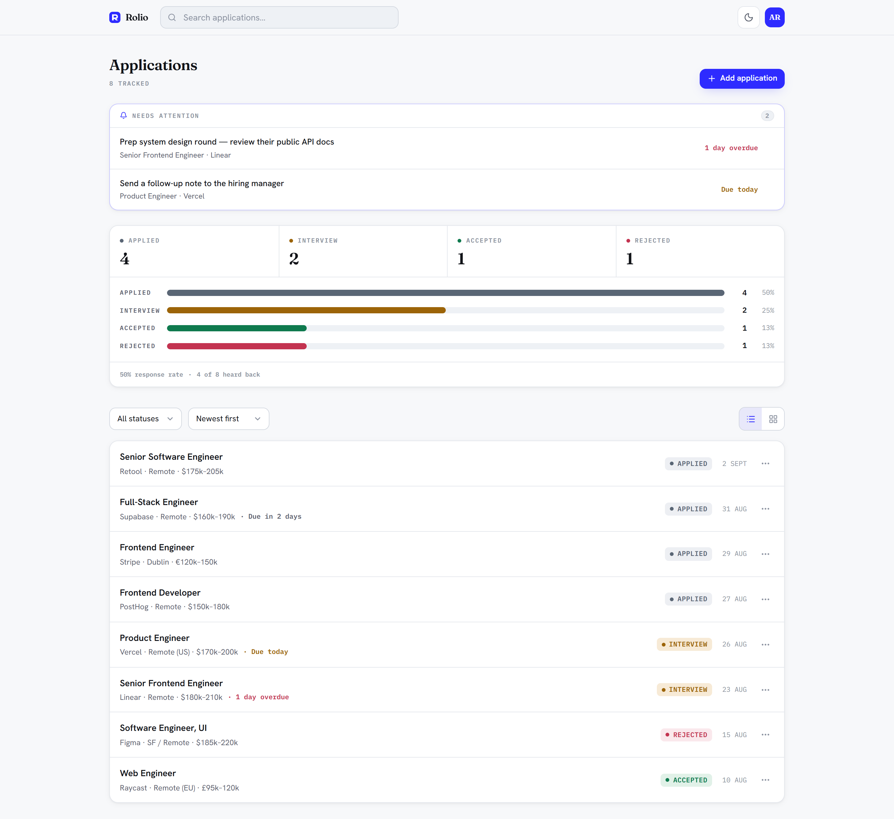
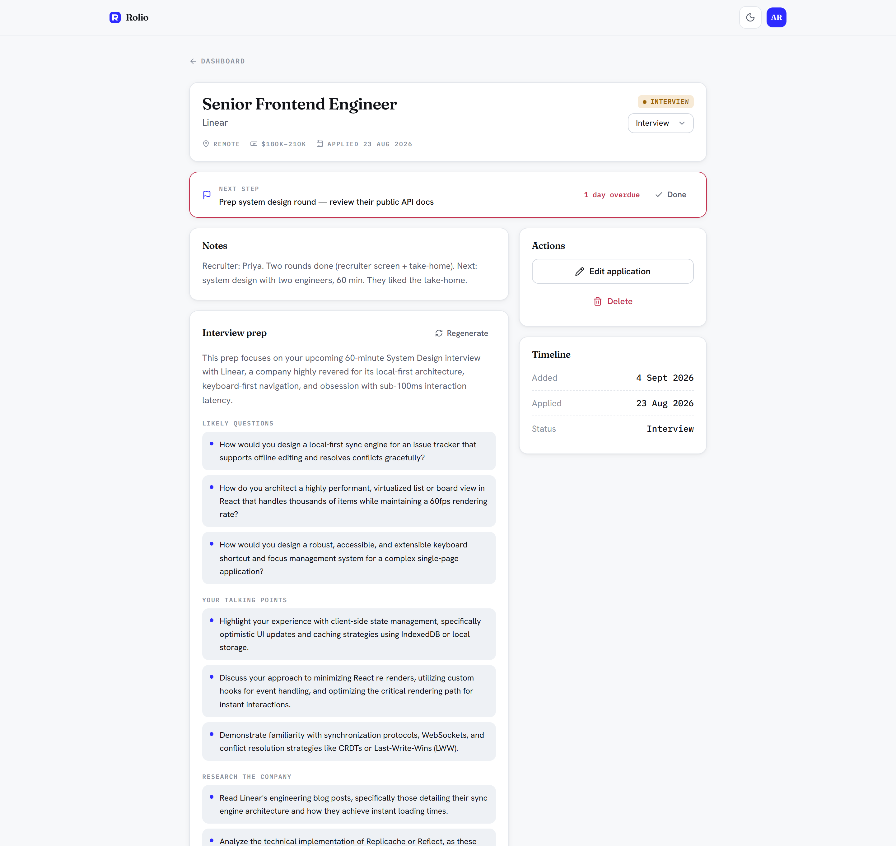

# Rolio

**Live:** <https://ai-job-tracker-frontend-opal.vercel.app>
*(the API is on a free tier that sleeps when idle — the first request after a quiet spell takes ~30s)*

A job-application tracker: register/login, per-user job CRUD with a list **and** kanban
board, freeform tags plus an archive for roles you're done tracking, a pipeline overview
with per-stage stats and a chart, a per-job detail page with a recruiter/hiring-manager
contact card, follow-up reminders (a "next step" + due date per role, surfaced in a
dashboard "Needs attention" strip) with an optional daily email digest, staleness flags
on applications that have gone quiet in a stage, an optional public share link for your
pipeline, and two AI touches — interview prep per role, and autofilling a new application
from a pasted job description. Light and dark themes.

<picture>
  <source media="(prefers-color-scheme: dark)" srcset="docs/dashboard-dark.png">
  
</picture>

Monorepo with two npm workspaces:

| Workspace | Path | Stack | Port |
|---|---|---|---|
| `backend` | `apps/backend` | NestJS 11, Prisma 5 + PostgreSQL, JWT (Passport) | 4000 |
| `frontend` | `apps/frontend` | Next.js 16, React 19, Tailwind 3 | 3000 |

## Getting started

```bash
npm install                          # once, from the repo root — installs both workspaces

cp apps/backend/.env.example       apps/backend/.env         # set DATABASE_URL + JWT_SECRET
cp apps/frontend/.env.local.example apps/frontend/.env.local # set NEXT_PUBLIC_API_URL if not :4000

npm run prisma:migrate -w backend    # apply DB migrations (or: npx prisma migrate dev)
npm run dev                          # starts backend (:4000) and frontend (:3000) together
```

Open <http://localhost:3000>. `/` is the marketing page; `/dashboard` requires a session.

## Scripts (run from the repo root)

| Command | Does |
|---|---|
| `npm run dev` | backend + frontend together (via `concurrently`) |
| `npm run dev:backend` / `npm run dev:frontend` | one side only |
| `npm run build` | production build of both |
| `npm run lint` | eslint both |
| `npm test` | backend (Jest) + frontend (Vitest) suites |
| `npm run test:backend` / `npm run test:frontend` | one suite only |
| `npm run e2e` | Playwright browser journey (needs Docker for a throwaway Postgres) |

Per-workspace scripts still work with `-w`, e.g. `npm run start:dev -w backend`.

## Design

Frontend visual system — "Editorial × Electric":

- **Type:** Fraunces (display), Hanken Grotesk (UI), IBM Plex Mono (data/labels)
- **Colour:** cool near-neutral greys + one electric ultramarine accent, used solid
- **Theme:** light + dark on CSS variables (`app/globals.css`), toggled via `next-themes`
- **Primitives:** `apps/frontend/components/ui/*` (button, input, select, card, dialog,
  badge, dropdown, …)

## AI features

Two things, both on **Google Gemini's free tier**:

- **Interview prep** — the job-detail page generates prep tailored to a role: likely
  questions, talking points, what to research, questions to ask — from the job's details
  and your notes.
- **Autofill from a job description** — paste a posting into the "Add application" dialog
  and it fills in the role, company, location, salary and a few notes for you to review.



It runs on **Google Gemini's free tier** (Flash models — no credit card). Set it up:

1. Get a free key at <https://aistudio.google.com/apikey>
2. Add it to `apps/backend/.env`: `GEMINI_API_KEY=...` (optionally `GEMINI_MODEL=`)
3. Restart. Without the key the feature shows an "not set up" message and nothing else
   is affected.

The provider is behind an interface (`apps/backend/src/prep/prep.types.ts`) — swapping in
Claude/OpenAI is one line in `prep.module.ts`. Note: Google may use free-tier prompts to
improve its products.

## Email digest

Opt in from the account menu (top right → **Settings**) and once a day you'll get an
email with any follow-ups that are due or overdue and any applications that have gone
quiet — each linking straight to the job. Off by default.

It runs on **Resend's free tier**, sending to your own account email (no domain
verification needed for that). Render's free plan has no cron, so the schedule lives in
GitHub Actions (`.github/workflows/email-digest.yml`), which calls a secret-protected
`POST /internal/digest` once a day. Set it up:

1. Get a free key at <https://resend.com/api-keys>
2. Add `RESEND_API_KEY` to the Render service's env vars
3. Generate any random string, add it as `DIGEST_SECRET` on Render **and** as a GitHub
   Actions repo secret (Settings → Secrets and variables → Actions)
4. Add a `DIGEST_URL` repo secret: `https://<your-render-service>.onrender.com/internal/digest`
5. Turn the toggle on in Settings. Test the schedule anytime from the Actions tab
   ("Email digest" → Run workflow) instead of waiting for the next scheduled run.

Without `RESEND_API_KEY`/`DIGEST_SECRET` set, the endpoint is disabled — nothing else is
affected, and the in-app "Needs attention" strip still works as before.

## Auth

Short-lived access tokens + refresh-token rotation, not a long-lived JWT in `localStorage`:

- The **access token** (15 min) comes back from login/signup in the response body and is
  kept in memory only — never `localStorage` — so it isn't readable by an injected script.
  It's gone on a full page reload by design.
- The **refresh token** lives in an **httpOnly, `SameSite` cookie** scoped to `/auth`
  (`Secure` + `SameSite=None` in production; plain `SameSite=Lax` on localhost), so
  frontend JS never touches it either. Each use **rotates** it — the old one is revoked in
  the database the moment a new one is issued, so a replayed/stolen token is rejected.
- A silent `POST /auth/refresh` on page load (and once, automatically, after any 401)
  recovers the session from that cookie — that's what makes losing the in-memory token on
  reload invisible to you as a user.
- **Logout** revokes that session's refresh token server-side, not just the cookie.

### Google sign-in

An optional "Continue with Google" button on login/signup, alongside email+password —
not a replacement for it. Signing in with Google links to any existing password account
with the same email automatically (safe, since Google only asserts *verified* emails).

It's a standard OAuth 2.0 authorization-code redirect: `GET /auth/google` sends the
browser to Google's consent screen, `GET /auth/google/callback` exchanges the code,
finds-or-creates the user, and sets the same refresh-token cookie a password login would
— so from there it rejoins the normal session flow above with no extra frontend code.
Set it up:

1. <https://console.cloud.google.com/apis/credentials> → **Create credentials** → **OAuth
   client ID** → **Web application**
2. Authorized redirect URI: `http://localhost:4000/auth/google/callback` for local dev
   (add the Render one too once deployed — see DEPLOYING.md)
3. Add `GOOGLE_CLIENT_ID` and `GOOGLE_CLIENT_SECRET` to `apps/backend/.env`
4. Restart. Without both set, the button doesn't render — `GET /auth/config` tells the
   frontend whether to show it — and email+password sign-in is unaffected either way.

## Public share link

Turn it on from the account menu (top right → **Settings**) and get a `/share/<token>`
link anyone can open without signing in — a read-only page with your pipeline stats and
each application's role, company, status, location and tags. **Salary, notes, contact
details and next-step text never leave the server for this page** — the public endpoint
selects only the fields above, regardless of what the frontend asks for. Archived
applications are excluded too.

The token rotates: turning the link off (or hitting **Regenerate**) immediately
invalidates the old one — the endpoint 404s once the token no longer matches any account.
Off by default.

## Case study

A few decisions worth explaining, for anyone reading the code rather than just the
feature list above.

**Auth: `localStorage` → memory + a rotating cookie.** The first version worked and is
extremely common — sign in, get a JWT, keep it in `localStorage`, done. But a JWT in
`localStorage` is trivially readable by an injected script, and this one lived for 7 days
no matter what. The fix wasn't "expire it faster" (that just logs people out constantly);
it was splitting responsibilities. A **15-minute access token that never touches
storage** — an in-memory variable, gone on reload by design — does the actual API calls.
A **rotating refresh token in an httpOnly cookie**, invisible to JavaScript entirely,
silently renews it. `apps/frontend/lib/api.ts` shares one in-flight refresh promise
across simultaneous 401s so a page firing five parallel requests doesn't trigger five
refreshes.

**Auditing the Google sign-in I'd just shipped.** After adding OAuth, I ran a security
review against the diff instead of assuming "uses a well-known library" meant "safe." It
found three real, specific issues, not generic advice:

1. Sign-in trusted the email string Google returned without checking Google's own
   `verified` claim — an unverified email could auto-link into someone else's existing
   account.
2. There was no OAuth `state` parameter, so a captured authorization URL could be replayed
   to log a victim into an *attacker's* account (textbook RFC 6749 §10.12 login CSRF).
   Since the app has no session middleware, the fix
   (`apps/backend/src/auth/google/oauth-state.store.ts`) is a stateless double-submit
   cookie rather than the OAuth library's session-backed default.
3. A pre-existing CORS rule allowing any `*.vercel.app` origin only became dangerous once
   the refresh-token cookie existed — combined with `credentials: true`, it would have let
   an attacker's own free Vercel deployment read another user's session. Scoped to this
   project's own preview URLs instead.

**Privacy in the share link, enforced at the query, not the view.** The public share page
shows role, company, status and tags to anyone with the link — never salary, notes, or a
recruiter's contact details. That's not a client-side filter:
`apps/backend/src/public/public.service.ts` explicitly `select`s only the fields meant to
be public, so a future bug in the frontend can't leak more than the schema already allows.

## Layout

```
apps/backend    NestJS API — auth, jobs, users, prep (AI), Prisma schema + migrations
apps/frontend   Next.js app — see apps/frontend/AGENTS.md for Next 16 rules
.git-archive    pre-consolidation git history of the two original repos (bundles)
```

## Known gaps / deferred work

- `GET /jobs` filtering, sorting and pagination are done client-side.
- Refresh tokens aren't pruned once expired/revoked — the rows just linger (harmless,
  since expiry/revocation is checked on every use, just not swept up).

## Deploying

Frontend → **Vercel**, API → **Render** (`render.yaml`), database → **Supabase** (already
provisioned). Both hosts auto-redeploy on push to `main`. See **[DEPLOYING.md](DEPLOYING.md)**,
or run the guided script:

```bash
bash scripts/deploy-wizard.sh
```
