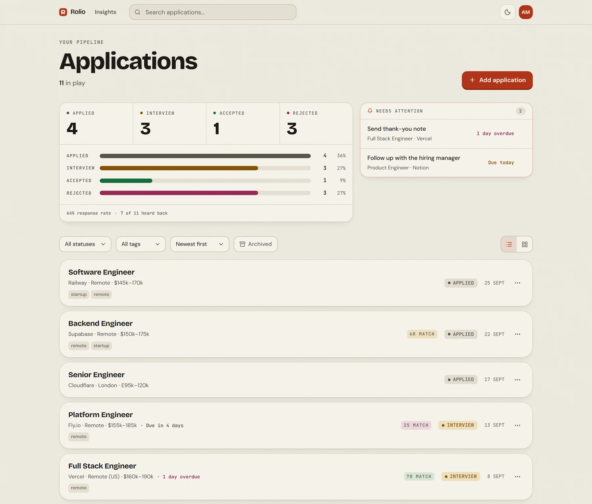
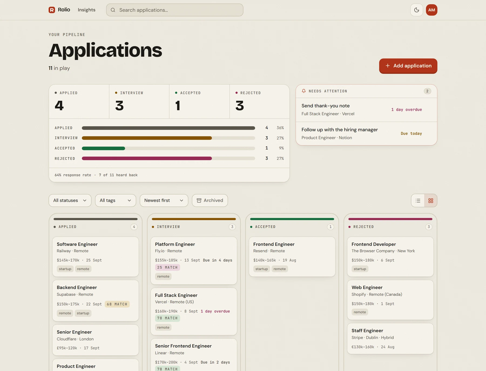
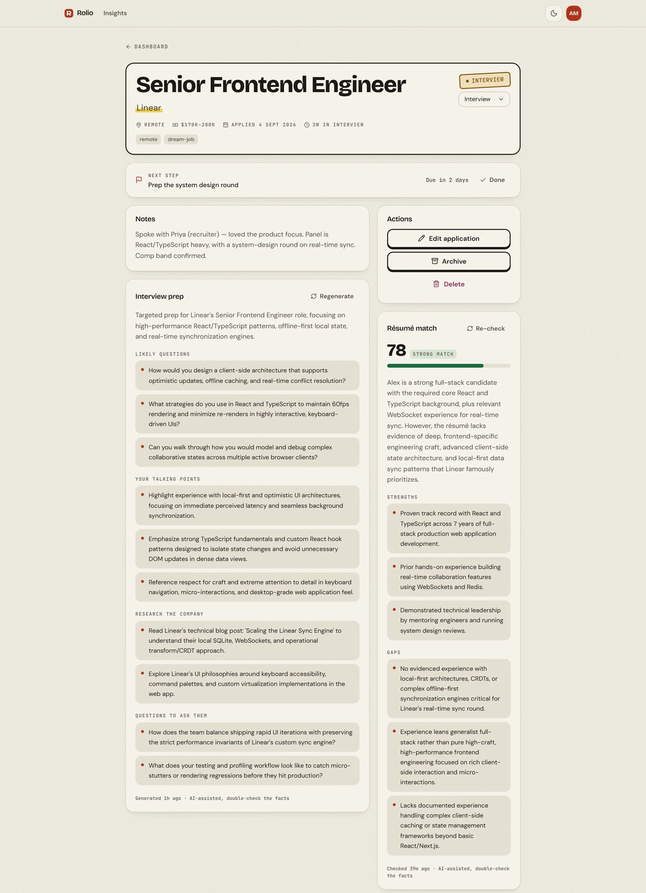
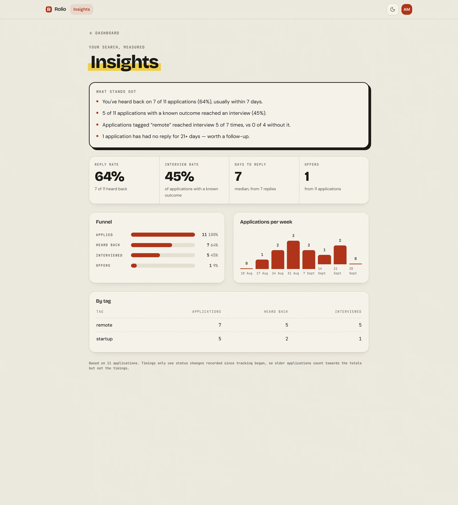

# Rolio

**Live:** <https://ai-job-tracker-frontend-opal.vercel.app>
*(the API is on a free tier that sleeps when idle — the first request after a quiet spell takes ~30s)*

A job-application tracker: register/login, per-user job CRUD with a list **and** kanban
board, freeform tags plus an archive for roles you're done tracking, a pipeline overview
with per-stage stats and a chart, a per-job detail page with a recruiter/hiring-manager
contact card, follow-up reminders (a "next step" + due date per role, surfaced in a
dashboard "Needs attention" strip) with an optional daily email digest, staleness flags
on applications that have gone quiet in a stage, an Insights page (funnel, reply rate and
timings from your own history), an optional public share link for your
pipeline, and three AI touches — interview prep per role, autofilling a new application
from a pasted job description, and a résumé match score per job. Light and dark themes.

<picture>
  <source media="(prefers-color-scheme: dark)" srcset="docs/dashboard-dark.webp">
  
</picture>

The same pipeline as a kanban board — each card carries its status, follow-up flags and
résumé match score:



Monorepo with two npm workspaces:

| Workspace | Path | Stack | Port |
|---|---|---|---|
| `backend` | `apps/backend` | NestJS 11, Prisma 5 + PostgreSQL, JWT (Passport) | 4000 |
| `frontend` | `apps/frontend` | Next.js 16, React 19, Tailwind 3 | 3000 |

## Getting started

```bash
npm install                          # once, from the repo root — installs both workspaces

cp apps/backend/.env.example       apps/backend/.env         # set DATABASE_URL + JWT_SECRET
cp apps/frontend/.env.local.example apps/frontend/.env.local # set NEXT_PUBLIC_API_URL if not :4000

npm run prisma:migrate -w backend    # apply DB migrations (or: npx prisma migrate dev)
npm run dev                          # starts backend (:4000) and frontend (:3000) together
```

Open <http://localhost:3000>. `/` is the marketing page; `/dashboard` requires a session.

## Scripts (run from the repo root)

| Command | Does |
|---|---|
| `npm run dev` | backend + frontend together (via `concurrently`) |
| `npm run dev:backend` / `npm run dev:frontend` | one side only |
| `npm run build` | production build of both |
| `npm run lint` | eslint both |
| `npm test` | backend (Jest) + frontend (Vitest) suites |
| `npm run test:backend` / `npm run test:frontend` | one suite only |
| `npm run e2e` | Playwright browser journey (needs Docker for a throwaway Postgres) |

Per-workspace scripts still work with `-w`, e.g. `npm run start:dev -w backend`.

## Design

Frontend visual system — "Paper & Ink":

- **Type:** Bricolage Grotesque (display), DM Sans (UI), JetBrains Mono (data/labels)
- **Colour:** warm paper, ink-black type, one vermilion accent (coral in dark mode). Every
  text/background pair clears WCAG AA.
- **Signature marks:** highlighter swipes (`.hl`), hard-offset "ink" cards (`.ink-card`),
  rubber-stamp labels (`.stamp`), a faint paper grain, and keycap buttons that press down
- **Theme:** light + dark on CSS variables (`app/globals.css`), toggled via `next-themes`
- **Primitives:** `apps/frontend/components/ui/*` (button, input, select, card, dialog,
  badge, dropdown, …)

## AI features

Four things, all on **Google Gemini's free tier**:

- **Interview prep** — the job-detail page generates prep tailored to a role: likely
  questions, talking points, what to research, questions to ask — from the job's details
  and your notes.
- **Autofill from a job description** — paste a posting into the "Add application" dialog
  and it fills in the role, company, location, salary and a few notes for you to review.
- **Résumé match score** — upload your résumé once (PDF or Word, in Settings) and check
  how well it fits any specific role from that job's page: a 0–100 score, a few concrete
  strengths, and the gaps worth addressing. Only the extracted text is ever stored — the
  file itself is parsed and discarded. Scoring is on demand per job, the same as prep; a
  score badge then shows on that job's row in the dashboard list.
- **Email drafts** — a "Draft an email" card on each job writes a follow-up, a thank-you
  after an interview, or a cover letter, addressed to the job's contact and signed with
  your name. You edit it, then copy it or open it in your mail app. Drafts use only what
  the app already knows (the cover letter also needs your résumé) and are never stored.



It runs on **Google Gemini's free tier** (Flash models — no credit card). Set it up:

1. Get a free key at <https://aistudio.google.com/apikey>
2. Add it to `apps/backend/.env`: `GEMINI_API_KEY=...` (optionally `GEMINI_MODEL=`)
3. Restart. Without the key the feature shows an "not set up" message and nothing else
   is affected.

The provider is behind an interface (`apps/backend/src/prep/prep.types.ts`) — swapping in
Claude/OpenAI is one line in `prep.module.ts`. Note: Google may use free-tier prompts to
improve its products.

## Email digest

Opt in from the account menu (top right → **Settings**) and once a day you'll get an
email with any follow-ups that are due or overdue and any applications that have gone
quiet — each linking straight to the job. Off by default.

It runs on **Resend's free tier**, sending to your own account email (no domain
verification needed for that). Render's free plan has no cron, so the schedule lives in
GitHub Actions (`.github/workflows/email-digest.yml`), which calls a secret-protected
`POST /internal/digest` once a day. Set it up:

1. Get a free key at <https://resend.com/api-keys>
2. Add `RESEND_API_KEY` to the Render service's env vars
3. Generate any random string, add it as `DIGEST_SECRET` on Render **and** as a GitHub
   Actions repo secret (Settings → Secrets and variables → Actions)
4. Add a `DIGEST_URL` repo secret: `https://<your-render-service>.onrender.com/internal/digest`
5. Turn the toggle on in Settings. Test the schedule anytime from the Actions tab
   ("Email digest" → Run workflow) instead of waiting for the next scheduled run.

Without `RESEND_API_KEY`/`DIGEST_SECRET` set, the endpoint is disabled — nothing else is
affected, and the in-app "Needs attention" strip still works as before.

## Auth

Short-lived access tokens + refresh-token rotation, not a long-lived JWT in `localStorage`:

- The **access token** (15 min) comes back from login/signup in the response body and is
  kept in memory only — never `localStorage` — so it isn't readable by an injected script.
  It's gone on a full page reload by design.
- The **refresh token** lives in an **httpOnly, `SameSite` cookie** scoped to `/auth`
  (`Secure` + `SameSite=None` in production; plain `SameSite=Lax` on localhost), so
  frontend JS never touches it either. Each use **rotates** it — the old one is revoked in
  the database the moment a new one is issued, so a replayed/stolen token is rejected.
- A silent `POST /auth/refresh` on page load (and once, automatically, after any 401)
  recovers the session from that cookie — that's what makes losing the in-memory token on
  reload invisible to you as a user.
- **Logout** revokes that session's refresh token server-side, not just the cookie.
- Dead tokens don't pile up: every time a new pair is issued (login, signup, Google
  sign-in, each rotation) that user's expired tokens, and ones revoked more than a day
  ago, are deleted. It's best-effort — a failed sweep never blocks a login.

### Google sign-in

An optional "Continue with Google" button on login/signup, alongside email+password —
not a replacement for it. Signing in with Google links to any existing password account
with the same email automatically (safe, since Google only asserts *verified* emails).

It's a standard OAuth 2.0 authorization-code redirect: `GET /auth/google` sends the
browser to Google's consent screen, `GET /auth/google/callback` exchanges the code,
finds-or-creates the user, and sets the same refresh-token cookie a password login would
— so from there it rejoins the normal session flow above with no extra frontend code.
Set it up:

1. <https://console.cloud.google.com/apis/credentials> → **Create credentials** → **OAuth
   client ID** → **Web application**
2. Authorized redirect URI: `http://localhost:4000/auth/google/callback` for local dev
   (add the Render one too once deployed — see DEPLOYING.md)
3. Add `GOOGLE_CLIENT_ID` and `GOOGLE_CLIENT_SECRET` to `apps/backend/.env`
4. Restart. Without both set, the button doesn't render — `GET /auth/config` tells the
   frontend whether to show it — and email+password sign-in is unaffected either way.

## Insights

`/dashboard/insights` turns your applications into answers: reply rate, interview rate,
median days to hear back, a funnel (applied → heard back → interviewed → offer), applications
per week, a per-tag breakdown, and a few plain-language takeaways ("Applications tagged
'remote' reached interview 3 of 6 times, vs 2 of 8 without it"). No AI involved — it's
deterministic maths in `apps/backend/src/insights/insights.calc.ts`, unit-tested against
fixed dates.



It works because every status change is recorded as a `StatusEvent` (written in the same
query as the job update), so the app knows the *path* a job took, not just where it ended
up. Two honesty rules: history from before that table existed has an unknown origin, so it
counts towards totals but is left out of timings and the interview rate; and anything
resting on fewer than 3 data points shows "—" instead of a percentage.

## Public share link

Turn it on from the account menu (top right → **Settings**) and get a `/share/<token>`
link anyone can open without signing in — a read-only page with your pipeline stats and
each application's role, company, status, location and tags. **Salary, notes, contact
details and next-step text never leave the server for this page** — the public endpoint
selects only the fields above, regardless of what the frontend asks for. Archived
applications are excluded too.

The token rotates: turning the link off (or hitting **Regenerate**) immediately
invalidates the old one — the endpoint 404s once the token no longer matches any account.
Off by default.

## Case study

A few decisions worth explaining, for anyone reading the code rather than just the
feature list above.

**Auth: `localStorage` → memory + a rotating cookie.** The first version worked and is
extremely common — sign in, get a JWT, keep it in `localStorage`, done. But a JWT in
`localStorage` is trivially readable by an injected script, and this one lived for 7 days
no matter what. The fix wasn't "expire it faster" (that just logs people out constantly);
it was splitting responsibilities. A **15-minute access token that never touches
storage** — an in-memory variable, gone on reload by design — does the actual API calls.
A **rotating refresh token in an httpOnly cookie**, invisible to JavaScript entirely,
silently renews it. `apps/frontend/lib/api.ts` shares one in-flight refresh promise
across simultaneous 401s so a page firing five parallel requests doesn't trigger five
refreshes.

**Auditing the Google sign-in I'd just shipped.** After adding OAuth, I ran a security
review against the diff instead of assuming "uses a well-known library" meant "safe." It
found three real, specific issues, not generic advice:

1. Sign-in trusted the email string Google returned without checking Google's own
   `verified` claim — an unverified email could auto-link into someone else's existing
   account.
2. There was no OAuth `state` parameter, so a captured authorization URL could be replayed
   to log a victim into an *attacker's* account (textbook RFC 6749 §10.12 login CSRF).
   Since the app has no session middleware, the fix
   (`apps/backend/src/auth/google/oauth-state.store.ts`) is a stateless double-submit
   cookie rather than the OAuth library's session-backed default.
3. A pre-existing CORS rule allowing any `*.vercel.app` origin only became dangerous once
   the refresh-token cookie existed — combined with `credentials: true`, it would have let
   an attacker's own free Vercel deployment read another user's session. Scoped to this
   project's own preview URLs instead.

**Privacy in the share link, enforced at the query, not the view.** The public share page
shows role, company, status and tags to anyone with the link — never salary, notes, or a
recruiter's contact details. That's not a client-side filter:
`apps/backend/src/public/public.service.ts` explicitly `select`s only the fields meant to
be public, so a future bug in the frontend can't leak more than the schema already allows.

**AI: the model writes, code decides.** The résumé match asks Gemini for a score and a
write-up — but the *verdict* ("strong / partial / weak") is computed in
`apps/backend/src/prep/match.calc.ts`, not asked of the model, so the label can never
disagree with the number beside it, and the thresholds are unit-tested at their boundaries.
Same instinct as the Insights takeaways, which are fixed rules over real numbers rather than
generated text. The uploaded PDF/Word file is parsed to plain text in memory and discarded —
only the text is stored — which avoided standing up file storage at all.

**A live bug that looked like one thing and was another.** Adding an application on the
live site silently did nothing. The cause wasn't in the form: the backend deploy on Render
had been *failing* for days (so it kept serving an old build), because `NODE_ENV=production`
— added in the auth-hardening commit — makes a bare `npm ci` skip the dev dependencies that
`nest build` needs. The frontend deployed fine and kept sending a field the stale API
rejected, and the form swallowed the error. Three fixes: `npm ci --include=dev`
(`render.yaml`), surfacing the server's message instead of swallowing it, and a
troubleshooting note in `DEPLOYING.md` — a failed deploy is silent by default.

**Diagnosing the AI outage by taking the app out of the loop.** Interview prep started
failing with a "rate-limited" error. Rather than guess at quotas or keys, I called Gemini
directly with the project's own key, in three steps: a plain prompt (instant), the app's
exact structured-JSON request (90+ seconds), and the same request with the model's
"thinking" switched off (3.6 seconds). The default model was spending its time reasoning
over a simple fill-in-the-template task and blowing past the app's timeout — so the fix was
one config line in the shared request path. Later 503 "high demand" spikes, and one case
where the model was fast when called directly but slow from the server, led to a one-shot
fallback model (`apps/backend/src/prep/gemini-errors.ts`) triggered only by an overload or
a timeout — never an auth failure, which a second model can't fix — with the per-attempt
timeout sized so two attempts still finish inside the frontend's shortest AI-call limit
(45 seconds).

## Layout

```
apps/backend    NestJS API — auth, jobs, users, insights, public share, email digest,
                AI (prep / autofill / résumé match), Prisma schema + migrations
apps/frontend   Next.js app — see apps/frontend/AGENTS.md for Next 16 rules
.git-archive    pre-consolidation git history of the two original repos (bundles)
```

## Known gaps / deferred work

- `GET /jobs` filtering, sorting and pagination are done client-side.

## Deploying

Frontend → **Vercel**, API → **Render** (`render.yaml`), database → **Supabase** (already
provisioned). Both hosts auto-redeploy on push to `main`. See **[DEPLOYING.md](DEPLOYING.md)**,
or run the guided script:

```bash
bash scripts/deploy-wizard.sh
```
